# 대규모 머신 러닝을 위한 학습 데이터를 쉽게 라벨링하세요 

### Summary 
Amazon SageMaker Ground Truth는 머신 러닝 모델을 위한 고품질 교육 데이터셋을 구축하는 데 도움이 됩니다. Ground Truth를 사용하면 원하는 벤더 회사인 Amazon Mechanical Turk의 라벨러나 머신 러닝과 함께 내부 민간 인력을 사용하여 라벨이 부착된 데이터셋을 만들 수 있습니다. Ground Truth의 라벨이 부착된 데이터셋 출력을 사용하여 Amazon SageMaker에서 머신 러닝 모델을 학습시키거나 Amazon Rekognition과 같은 AI 서비스를 사용하여 컴퓨터 비전 사용 사례를 분석할 수 있습니다. .

### Workshop Details
1. Sagemaker Ground Truth private workforce을 양성하세요.
2. 라벨링을 할 이미지 데이터셋을 업로드할 수 있는 S3 버킷을 만듭니다.
3. Sagemaker 스튜디오 노트북으로 이동하여 노트북 코드를 다운로드하세요.
4. 노트북 코드를 실행합니다.
5. 라벨링 작업 생성 및 확인
6. 포털에 로그인하고 라벨링 작업을 시작하세요.
7. 결과를 확인합니다.

### Architecture
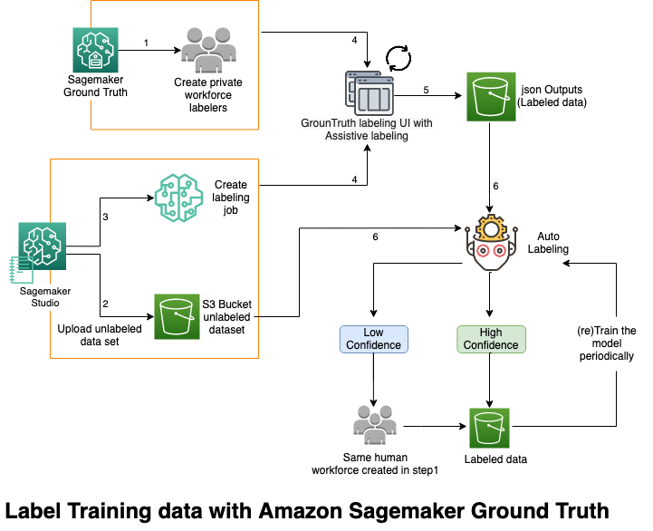

1. Amazon SageMaker Ground Truth의 라벨링 작업자 페이지를 사용하여 사설 인력 라벨러를 생성합니다.
2. 라벨이 없는 로고 이미지 데이터셋을 S3 버킷에 업로드하세요.
3. Sagemaker Studio 노트북에서 1단계에서 생성된 개인 인력을 사용하여 라벨링 작업을 만듭니다.
4. URL에서 서명을 통해 라벨링 포털을 열고 보조 라벨링으로 라벨링 프로세스를 시작합니다.
5. 라벨이 붙은 출력 json 데이터는 S3 버킷에 저장됩니다.
6. 그라운드 트루스는 출력 데이터를 사용하여 자동 라벨링 모델을 학습시킵니다. 생성한 모델을 사용하여 라벨이 없는 나머지 이미지에 라벨을 붙이려고 합니다. 신뢰도가 높은 자동 라벨링된 이미지는 "완료"(라벨)된 것으로 간주되어 S3에 저장됩니다. 신뢰도가 낮은 이미지는 민간 인력에게 파견되어 또 다른 라벨링 라운드를 진행합니다. 라벨이 지정된 데이터는 모델을 주기적으로 지속적으로 학습시키는 데 사용됩니다.

## Step 1 : Create Sagemaker Ground Truth Workforce

Amazon SageMaker Ground Truth를 통해 다양한 인력 옵션에 액세스할 수 있습니다:

* Amazon Mechanical Turk – 전 세계 50만 명 이상의 독립 계약자가 24시간 연중무휴로 근무하는 온디맨드 인력을 이용할 수 있습니다. 이 옵션은 민감하지 않은 데이터에 권장됩니다.
* Private – 자체 직원 또는 계약자 팀을 위해 액세스 권한을 설정할 수 있습니다. 이 옵션은 민감한 데이터나 라벨링 작업에 도메인 전문 지식이 필요한 경우에 권장됩니다.
* Vendor managed - 데이터 라벨링 서비스 제공을 전문으로 하는 Amazon의 승인을 받은 타사 공급업체 목록을 AWS 마켓플레이스를 통해 이용할 수 있습니다.

이 튜토리얼에서는 'Private' 인력을 라벨링 멤버로 사용하여 이미지로 데이터셋 라벨을 라벨링합니다.

Let's get started.

1. 아래에 표시된 검색창에서 SageMaker를 입력하여 Amazon SageMaker 콘솔로 이동하세요.

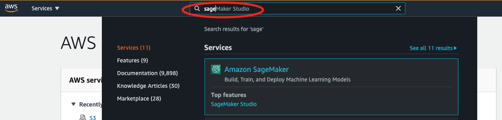

2. 왼쪽 창에서 GroundTruth를 선택합니다.

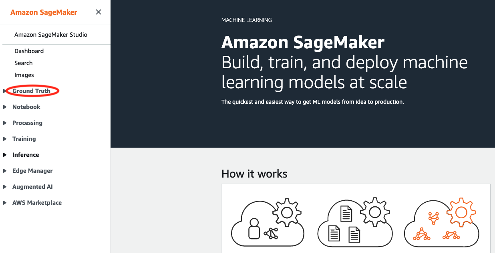

3. 라벨링 작업자를 선택합니다.

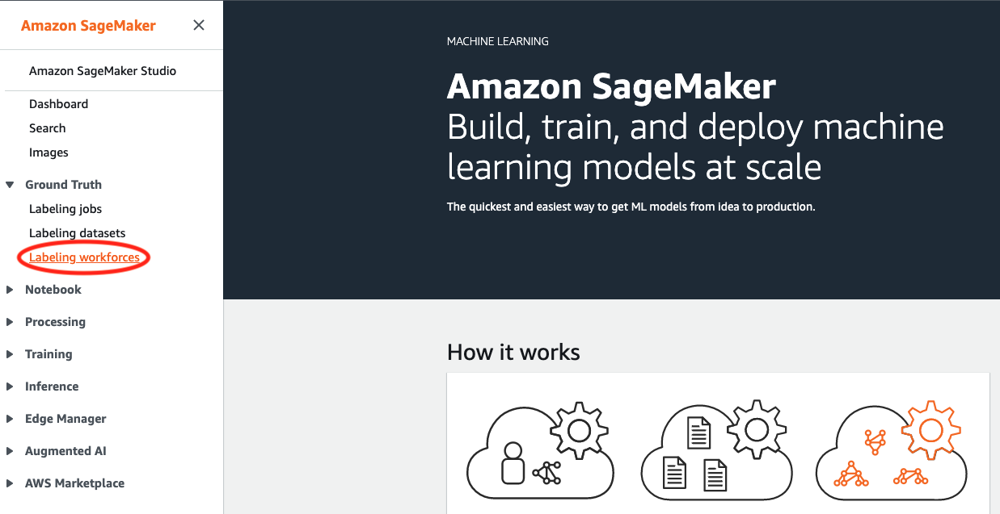

4. Private 탭을 클릭하고 'Private 팀 만들기'를 선택합니다

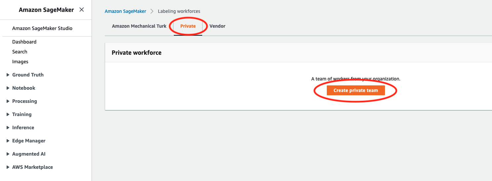

5. 'AWS Cognito로 Private 팀 만들기'를 선택합니다. 팀 세부 정보 아래에 팀 이름을 입력하고 이메일 주소와 조직 이름을 입력한 다음 직원 추가 섹션에 Private 팀 만들기를 클릭합니다. 제공한 이메일 주소에 액세스할 수 있는지 확인합니다.

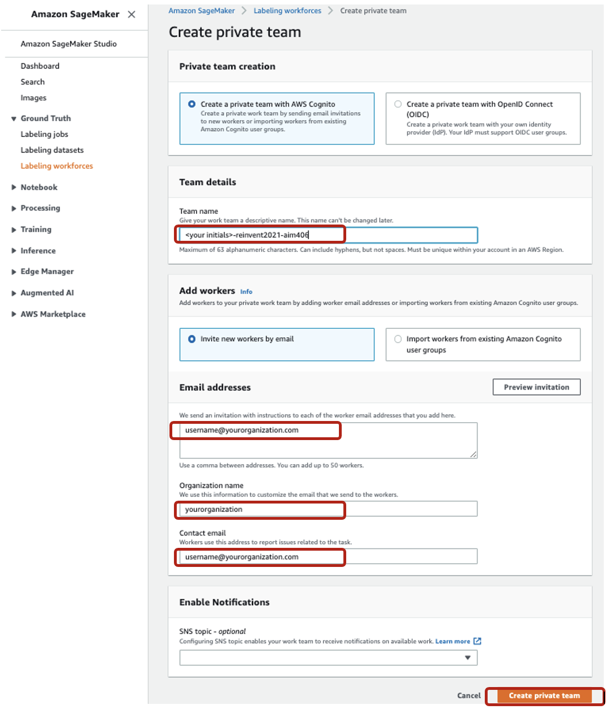

6. 요약을 검토하고 Private Team ARN을 메모장에 복사하세요. 나중에 랩에서 사용할 예정입니다.

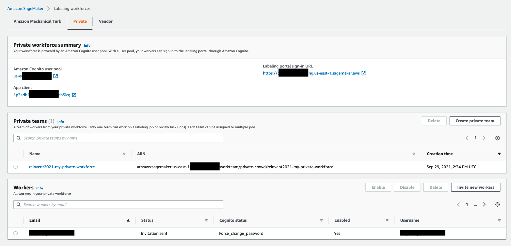

7. 아래 예시 이메일과 유사하게, 5단계에서 제공한 이메일 주소로 확인 이메일을 받았어야 합니다. 

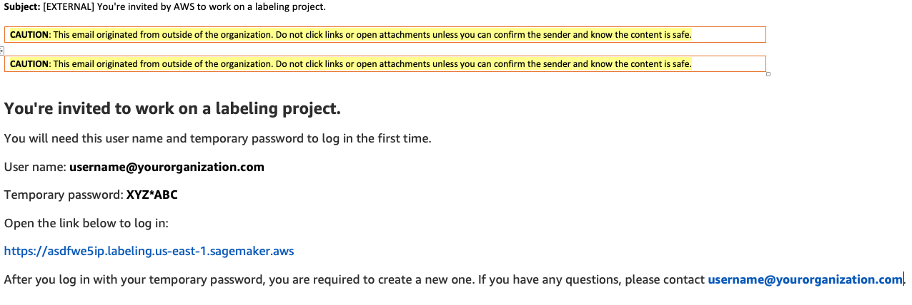

사용자 이름과 임시 비밀번호를 메모장에 복사하세요. 이를 사용하여 라벨링 포털에 로그인합니다.

## 2단계: 라벨링 데이터를 보관할 수 있는 S3 버킷을 만듭니다.

1. 상단의 서비스 로케이터를 사용하여 S3를 검색하세요.

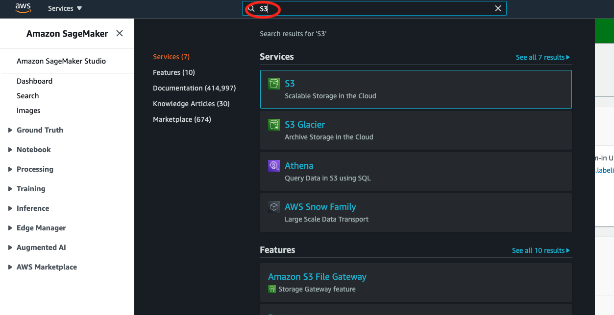

2. 버킷 만들기 클릭

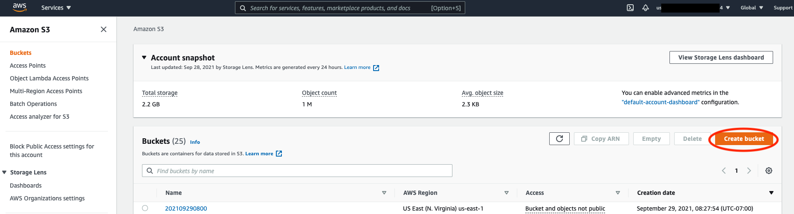

3. 버킷에 고유한 이름 <(yourname-reinvent-2021)> 을 지정하고 모든 항목을 기본값으로 설정한 후 버킷 만들기를 클릭합니다. 버킷이 Ground Truth와 동일한 AWS 영역에 있는지 확인합니다. 

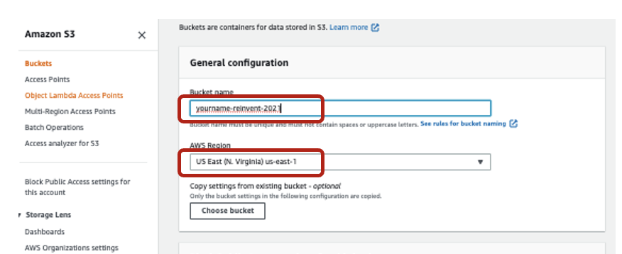

버킷 이름을 메모장에 복사하세요. 세이지메이커 노트북에 사용하겠습니다.
 

## 3단계: 세이지메이커 스튜디오로 이동합니다

1. 아래에 표시된 검색창에서 SageMaker를 입력하여 Amazon SageMaker 콘솔로 이동하세요.

2. 세이지메이커 스튜디오를 클릭합니다. 

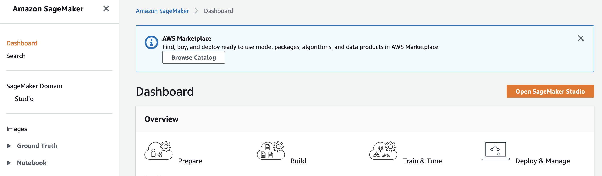

3. 이미 자신을 위해 생성된 사용자 "세이지메이커 사용자"를 볼 수 있습니다. Open Studio를 클릭하면 Launcher 화면으로 이동합니다.

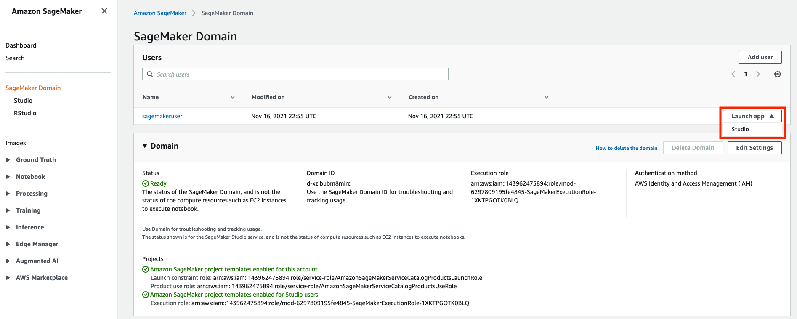

## 4단계: 노트북 코드 다운로드

1. 세이지메이커 스튜디오에서 파일 -> 새 -> 터미널을 클릭합니다 

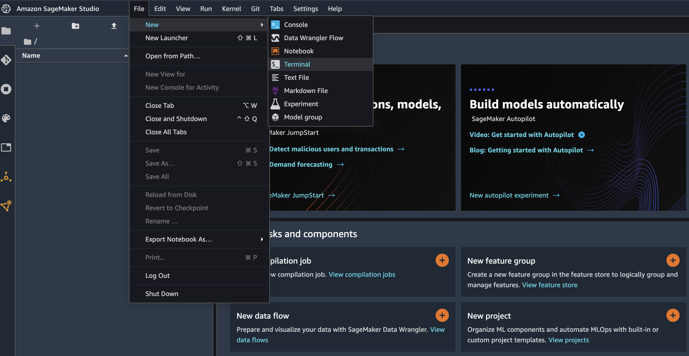

2. 터미널 유형에서 

`git clone https://github.com/aws-samples/sagemaker-ground-truth-label-training-data.git`
`git clone https://github.com/psps97/amazon-sagemaker-train-and-deploy-yolov11.git`

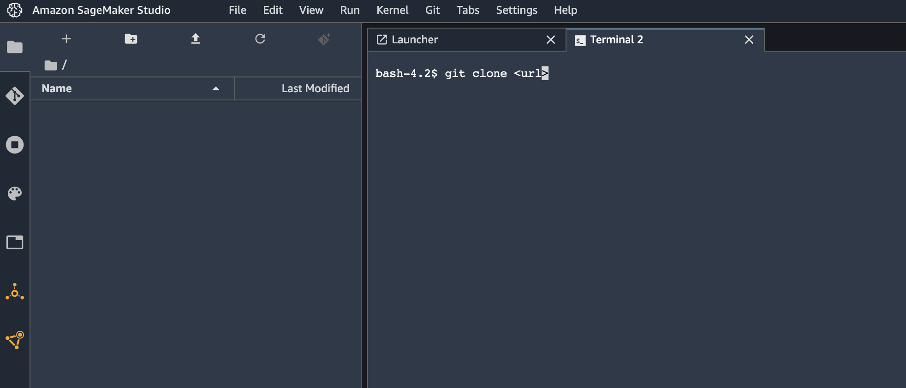

3. 이제 오른쪽 창에 폴더ㄱ가 표시됩니다

4. 다운로드한 폴더에서 ipynb 노트북을 클릭하여 엽니다

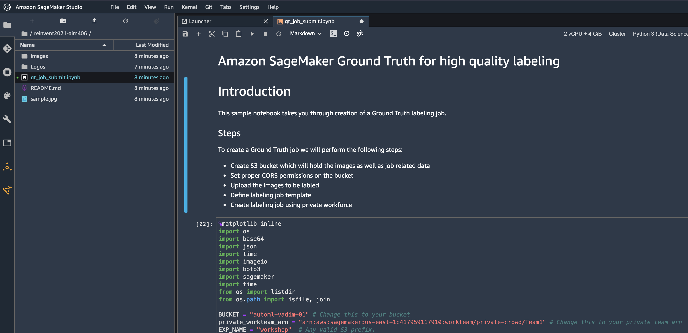

## 5단계: 노트북 실행.

아래 값들을 메모장에 복사한 버킷 이름과 개인 작업팀 ARN으로 대체하세요.

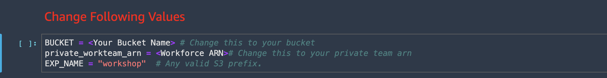

지시에 따라 노트북의 모든 셀을 실행하세요.

## 6단계: 라벨링 작업 생성 확인

1. 상단의 서비스 로케이터를 통해 Sagemaker 콘솔로 이동한 후 "Ground Truth" -> "Labeling Jobs"를 선택합니다. 

2. 이제 "진행 중" 상태의 라벨링 작업이 표시됩니다. 작업 이름을 클릭합니다.

## 5단계: 노트북 실행.

아래 값들을 메모장에 복사한 버킷 이름과 개인 작업팀 ARN으로 대체하세요.

지시에 따라 노트북의 모든 셀을 실행하세요.

## 6단계: 라벨링 작업 생성 확인

1. 상단의 서비스 로케이터를 통해 Sagemaker 콘솔로 이동한 후 "Ground Truth" -> "Labeling Jobs"를 선택합니다.

2. 이제 "진행 중" 상태의 라벨링 작업이 표시됩니다. 작업 이름을 클릭합니다.

3. 작업 요약 라벨링 아래에서 더 많은 세부 사항을 확인할 수 있을 것입니다.

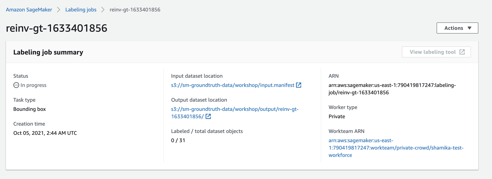

## 7단계: 라벨링 프로세스를 시작합니다.

1. "Ground Truth -> Labeling Workforce -> Private에 있는 "Private Workforce 요약"으로 돌아가세요. 그런 다음 "Labeling Portal Sign-in URL"을 클릭하세요.

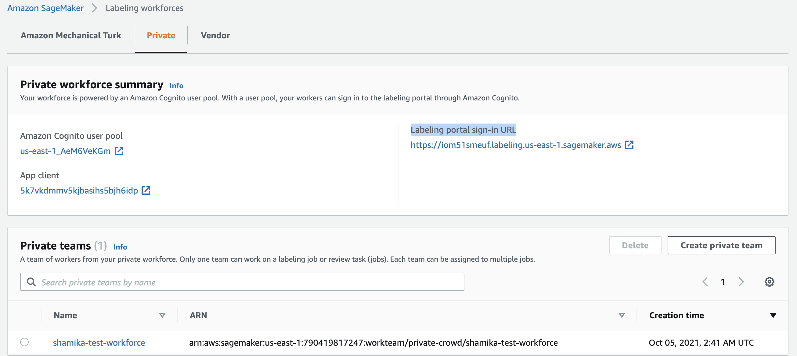

이렇게 하면 새 브라우저 탭에서 애플리케이션이 열립니다.

2. 이전에 받은 사용자 이름과 비밀번호를 사용하여 로그인합니다. (메시지가 나타나면 변경 후 새 비밀번호 입력)

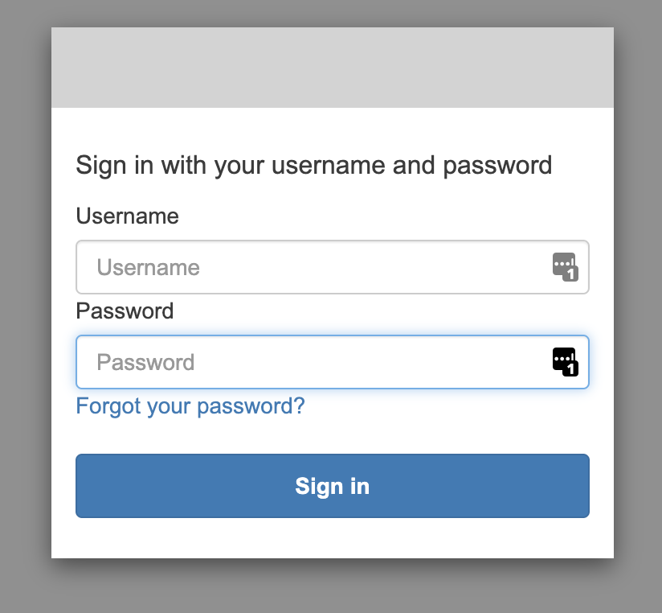

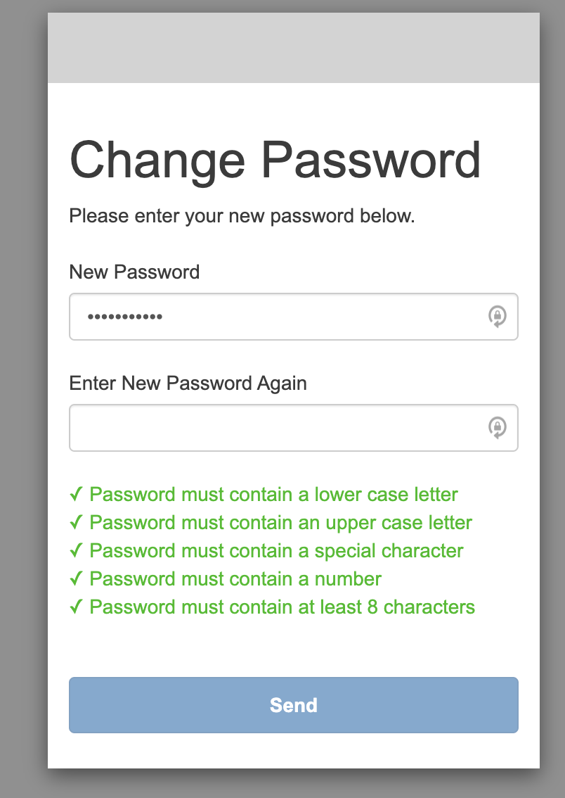

3. 작업을 선택하고 작업 시작을 클릭하여 라벨링 작업을 시작합니다.

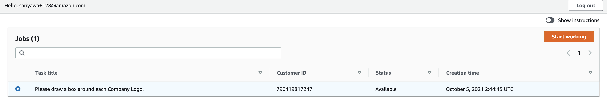

4. 라벨링 창에서 적절한 라벨을 선택하고 해당 로고가 포함된 경계 상자를 그린 다음 제출을 클릭합니다. 아래 예시를 참조하세요.

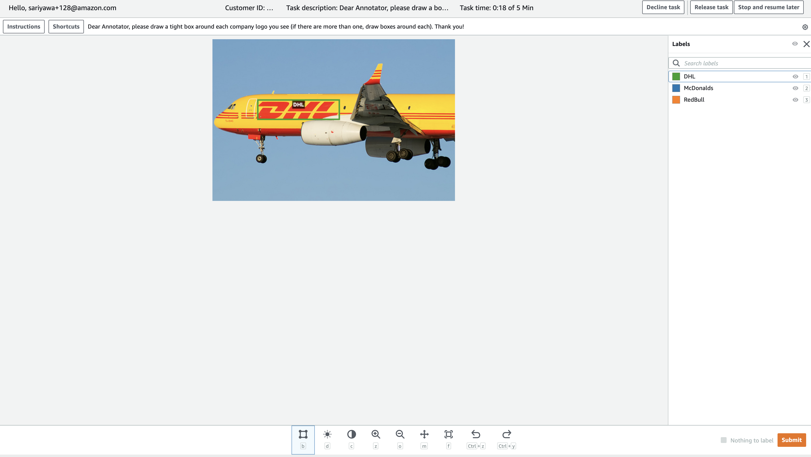

5. 모든 이미지가 완성될 때까지 과정을 계속하세요. 

6. 방금 첫 번째 이미지 배치에 라벨링을 완료했습니다. 이제 GroundTruth는 이 세트를 사용하여 자동 라벨링 모델을 훈련합니다. 그런 다음 이 모델을 사용하여 나머지 이미지에 라벨링을 시도합니다. 신뢰도가 높은 자동 라벨링된 이미지는 "완료"(라벨링)된 것으로 간주됩니다. 신뢰도가 낮은 하위 이미지 세트가 다시 라벨링을 위해 사용자에게 발송되며, 그 후 GroundTruth는 다시 자동 라벨링을 시도합니다. 

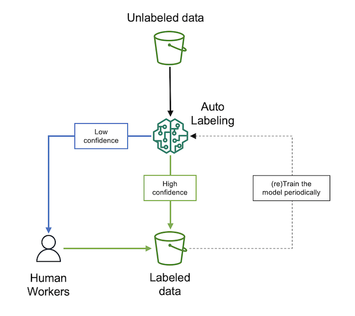

라벨링한 세트가 매우 작았기 때문에, Ground Truth 빌드 모델이 나머지 이미지에 라벨링하는 데 높은 신뢰도를 가지지 못할 것이라고 가정해도 무방합니다. 라벨링 대기열을 계속 새로 고치면 (라벨링 작업 UI에서) 약 5분 후에 다른 배치가 라벨링을 위해 발송되는 것을 볼 수 있습니다.

## 8단계: 결과 확인

1. 서비스 로케이터를 사용하여 2.3단계에서 캡처한 S3 버킷으로 이동합니다. 그 안에서 5단계에서 사용한 접두사가 있는 폴더를 찾습니다. 아래와 같이 폴더 구조를 자세히 살펴보세요.

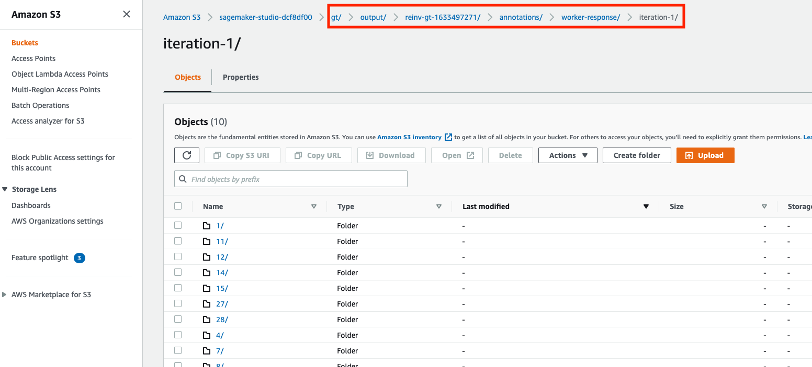

2. 아래와 같이 json 파일이 포함된 여러 폴더를 찾을 수 있을 것입니다.

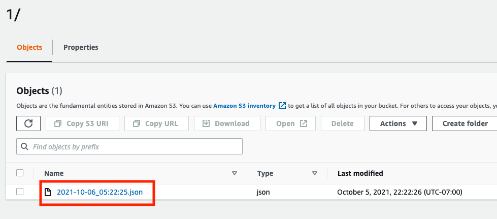

3. json 파일을 다운로드하고 내용을 확인하세요.

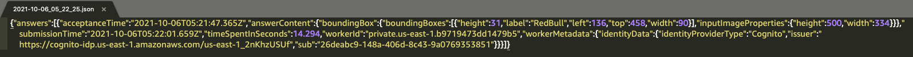

4. 작업이 완전히 완료되면 최종 매니페스트 채우기가 다음 접두사를 가진 폴더에 위치하게 됩니다. 이는 다운스트림 머신 러닝 애플리케이션에 사용할 수 있습니다. (추가 리소스 섹션에 대한 자세한 정보)

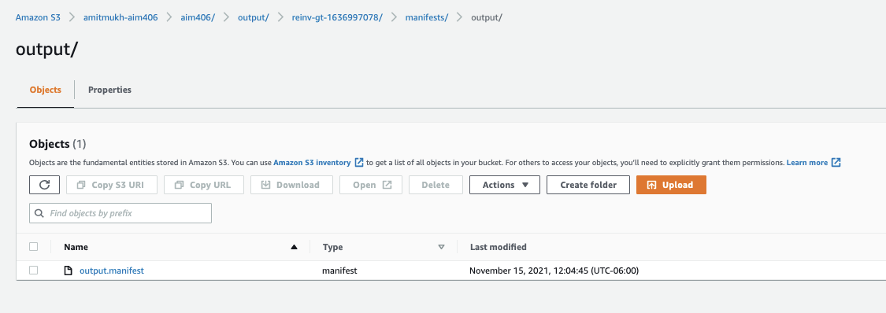

## 참고 : Automatic labeling

1. Ground Truth가 나머지 이미지들을 비교적 높은 신뢰도로 라벨링할 수 있는 모델을 훈련시키기 위해서는 수백 장의 라벨링된 이미지가 필요합니다. Ground Truth 자동 라벨링의 정확성을 설명하기 위해, 우리는 1000장의 다른 사진 배치를 미리 전처리했으며, 여기에 인간과 자동 라벨링 통계의 분석 결과가 있습니다:

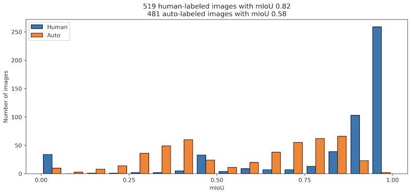

2. 완료된 자동 라벨링 작업의 출력 매니페스트를 검사하면 어떤 이미지가 자동으로 라벨링되었는지 확인할 수 있습니다:

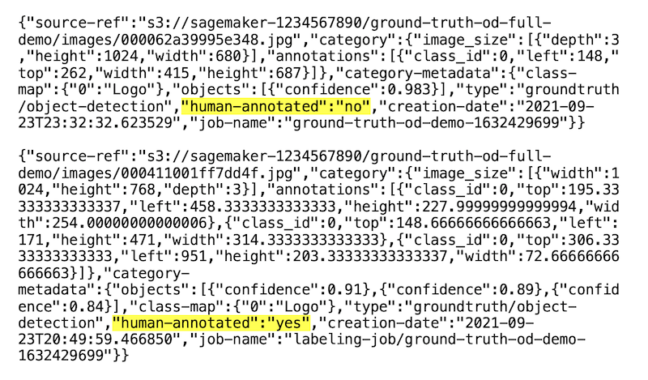

